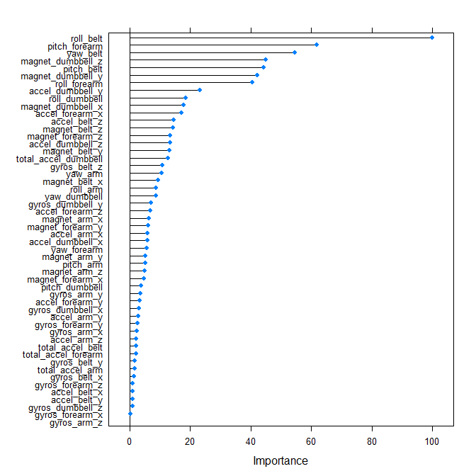

# Practical Machine Learning - Course Project Report: Weight Lifting Activity Prediction
Frank La  
March 21, 2016  


# Overview

A recent research [1] studied human activity recognition using data collected from accelerometers that are put on the on the belt, forearm, arm, and dumbbell of participants. The goal of the research is to classify *how correctly* an activity is performed.

Six young healthy participants were asked to perform one set of 10 repetitions of a weight lifting exercise, i.e., the Unilateral Dumbbell Biceps Curl, in five different fashions: *exactly according to the specification (Class A), throwing the elbows to the front (Class B), lifting the dumbbell only halfway (Class C), lowering the dumbbell only halfway (Class D) and throwing the hips to the front (Class E)*. Class A corresponds to the specified execution of the exercise, while the other 4 classes correspond to common mistakes. For more information, see [here](http://groupware.les.inf.puc-rio.br/har#ixzz42r9pPrVl).


In this project, I use the available data to develop machine learning models in order to classify the above classes of weight lifting execution. This report documents how to obtain and preprocess the data for machine learning; how to train different classifiers; and how to use the models for predicting on test data, including the Coursera quiz data.

This analysis is done with `R` v3.2.2, and packages `caret` v6.0-64, `randomForest` v4.6-12, `gbm` v2.1.1, `e1071` v1.6-7, `nnet` v7.3-10, `MASS` v7.3-43. 


# Data Preprocessing

## Load and Read Data


First, load some `R` libraries.

```r
library(caret); library(e1071)
```

The data is downloaded and read. 


```r
if(!exists("pml.training")){
  if(!file.exists("pml-training.csv")) {
    download.file("https://d396qusza40orc.cloudfront.net/predmachlearn/pml-training.csv", 
                  destfile="pml-training.csv")
  }
  pml.training <- read.csv("pml-training.csv", header = TRUE, na.strings = c("NA",""))
}

if(!exists("pml.quiz")){
  if(!file.exists("pml-testing.csv")) {
    download.file("https://d396qusza40orc.cloudfront.net/predmachlearn/pml-testing.csv", 
                  destfile="pml-testing.csv")
  }
  pml.quiz <- read.csv("pml-testing.csv", header = TRUE, na.strings = c("NA",""))
}
```
 
The dataframe `pml.training` contains all the training data. By peeking at the data (`view(pml.training)` in RStudio), we see that it has 19622 observations on 160 variables, where the `classe` variable in the 160th column is the label (A, ..., E) to be predicted. Among the rest of the variables, not all can be used as predictors and we subsequently need to filter the relevant variables.

Meanwhile, `pml.quiz` contains 20 samples whose labels are not given. They are the 20 prediction problems on Coursera Prediction Quiz. There is no `classe` variable and the last column is named `problem_id`. 


## Data Splitting

The first thing to do is to split the data into a training set and a test set. Here I use a 80:20 ratio, because subsequently I employ $K$-fold cross validation which further subdivides the training set. So I have roughly a 60:20:20 division for training, cross validation and testing.


```r
set.seed(7000)
inTrain <- createDataPartition(pml.training$classe, p = 0.80)[[1]]

training <- pml.training[ inTrain,]
testing <- pml.training[-inTrain,]
```


## Variable Selection 

### Removing Non-measurement Variables

Firstly, look at variables 1 to 7 from the data. 


```r
names(pml.training[,1:7])
```

```
## [1] "X"                    "user_name"            "raw_timestamp_part_1"
## [4] "raw_timestamp_part_2" "cvtd_timestamp"       "new_window"          
## [7] "num_window"
```

A quick look at their values and the paper [1] shows that they have nothing to do with measurements from the accelerometers. Thus, they are not relevant for the prediction exercise and can be removed.


```r
training <- training[, -(1:7)]
testing <- testing[, -(1:7)]
pml.quiz <- pml.quiz[, -(1:7)]
```

Note that whatever transformation on the training set applies equally on the test set and the quiz set.

### Removing NA-dominant Variables

Our dataset has several columns that are predominantly NAs. 


```r
NAproportion <- apply(training, 2, function(x){
  sum(is.na(x)) / nrow(training)
})
table(NAproportion)
```

```
## NAproportion
##                0 0.97897955283776 
##               53              100
```

We see that 100 variables contain 97.9% NAs. Any variable with more than 90% NAs does not have much predicting power and should be removed.


```r
training <- training[,-which(NAproportion > 0.9)]
testing <- testing[, -which(NAproportion > 0.9)]
pml.quiz <- pml.quiz[, -which(NAproportion > 0.9)]
```

### Near-zero Variance Predictors

We could also check if any variables with near-zero variance (and hence little predicting power).


```r
nearZeroVar(training) 
```

```
## integer(0)
```

The result is empty, indicating no such variables.

Thus, the training set is now finalized. It has 15699 observations and 53 variables (with `classe` in the 53th column):


```r
dim(training)
```

```
## [1] 15699    53
```


## Cross Validation Settings

Now, I specify the training options. 


```r
fitControl <- trainControl(method = "cv", number = 5, allowParallel = TRUE)
```

Basically, I use 5-fold cross validation on my training set. In addition, the `allowParallel` option enables parallel processing on multiple cores on my computer, which will save me a lot of time on heavy tasks such as the random forest algorithm.  


# Model Development

I plan to train several different models to see how they perform on the given data. The various models I choose are popular classification models, including:

- Multinomial Logistic Regression
- Linear Discriminant Analysis
- $K$-Nearest Neighbors
- Random Forest
- Support Vector Machine
- Generalized Boosted Model


## Multinomial Logistic Regression


```r
set.seed(1000)
time.multinom <- system.time({
  m.multinom <- train(x = training[, -53], y = training$classe, method = "multinom", 
                    trControl = fitControl, trace = FALSE)
})
```

I train the model using CARET's `multinom` method from the `nnet` package (thus it should be installed beforehand), with default options. The `trace=FALSE` option is to prevent `R` to print out computation details. In addition, I wrap the call of `train()` inside `system.time()` to compute its runtime. 

(See [here](https://topepo.github.io/caret/modelList.html) for a complete list of `caret` methods and which packages they are from.)


## Linear Discriminant Analysis

Similarly, I train a `lda` model as follows. This will implicitly use the `MASS` package.


```r
set.seed(1000)
time.lda <- system.time({
  m.lda <- train(x = training[, -53], y = training$classe, method = "lda", trControl = fitControl)
})
```


## $K$-Nearest Neighbors

For the `knn` method, I choose to center and scale the data.


```r
set.seed(1000)
time.knn <- system.time({
  m.knn <- train(x = training[, -53], y = training$classe, method = "knn",  
               trControl = fitControl, preProcess = c("center","scale"))
})
```


## Random Forest

For random forest, I use the `parRF` method to make it run on 4 parallel cores. In addition, `prox = F` and `nodesize = 10` are specified so as to reduce the amount of computation and speed up the method. 


```r
set.seed(1000)
library(doParallel); registerDoParallel(cores = 4)
time.parRF <- system.time({
  m.parRF <- train(x = training[, -53], y = training$classe, method = "parRF", trControl = fitControl, 
                 prox = F, nodesize = 10)
})
```


## Support Vector Machine

For SVM, I use the `svm()` function from `e1071` package.


```r
set.seed(1000)
time.svm <- system.time({
  m.svm <- svm(classe ~ ., data = training)
})
```


## Generalized Boosted Model

Finally, the `gbm` model.


```r
set.seed(1000)
time.gbm <- system.time({
  m.gbm <-  train(x = training[, -53], y = training$classe, method = "gbm", 
                trControl = fitControl, verbose = FALSE)
})
```


# Prediction on test set

I calculate the accuracy of the trained models on both the training set and test set. 


```r
cm.multinom1 <- confusionMatrix(predict(m.multinom, newdata = training[,-53]), training$classe)
cm.multinom2 <- confusionMatrix(predict(m.multinom, newdata = testing[,-53]), testing$classe)
```


```r
cm.lda1 <- confusionMatrix(predict(m.lda, newdata = training[,-53]), training$classe)
cm.lda2 <- confusionMatrix(predict(m.lda, newdata = testing[,-53]), testing$classe)
```


```r
cm.knn1 <- confusionMatrix(predict(m.knn, newdata = training[,-53]), training$classe)
cm.knn2 <- confusionMatrix(predict(m.knn, newdata = testing[,-53]), testing$classe)
```


```r
cm.parRF1 <- confusionMatrix(predict(m.parRF, newdata = training[,-53]), training$classe)
cm.parRF2 <- confusionMatrix(predict(m.parRF, newdata = testing[,-53]), testing$classe)
```


```r
cm.svm1 <- confusionMatrix(predict(m.svm, newdata = training[,-53]), training$classe)
cm.svm2 <- confusionMatrix(predict(m.svm, newdata = testing[,-53]), testing$classe)
```


```r
cm.gbm1 <- confusionMatrix(predict(m.gbm, newdata = training[,-53]), training$classe)
cm.gbm2 <- confusionMatrix(predict(m.gbm, newdata = testing[,-53]), testing$classe)
```


Table 1 shows the accurate prediction rates on the training set as well as the test set. I also include one set of elapsed time for training each of the model as another performance criterion (the amount of time may vary on different runs and depend on the computer used to run the script or the random seed; hence a more accurate measure is to run multiple times and average the results). 


```r
library(knitr)
X <- data.frame(c("Multinom", "LDA", "kNN", "RF", "SVM", "GBM"), 
                c(cm.multinom1$overall[1], cm.lda1$overall[1], cm.knn1$overall[1],
                             cm.parRF1$overall[1], cm.svm1$overall[1], cm.gbm1$overall[1]), 
                c(cm.multinom2$overall[1], cm.lda2$overall[1], cm.knn2$overall[1],
                             cm.parRF2$overall[1], cm.svm2$overall[1], cm.gbm2$overall[1]), 
                c(time.multinom[3], time.lda[3], time.knn[3], time.parRF[3], time.svm[3], time.gbm[3]))
kable(X, digits = 4, caption = "Table 1: Performance of the various models.",
      col.names = c("Method","Train Accuracy","Test Accuracy", "Elapsed Time (seconds)"))
```


Table: Table 1: Performance of the various models.

Method      Train Accuracy   Test Accuracy   Elapsed Time (seconds)
---------  ---------------  --------------  -----------------------
Multinom            0.6770          0.6791                   128.36
LDA                 0.7044          0.7092                     2.09
kNN                 0.9887          0.9737                    46.58
RF                  0.9994          0.9946                   112.70
SVM                 0.9522          0.9498                    36.40
GBM                 0.9748          0.9625                   112.30


Here are some remarks on the results:

- The `multinom` and `lda` methods do worse than the others.
- The `knn`, `rf`, `svm` and `gbm` all achieve good accuracy of over 95% on both sets. 
- The performance between the training set and the test set is insignificant so less chance of overfitting the model. 
- Both `rf` and `gbm` take a long time to train due to the large number of submodels they need to compute. `rf` turns out to be most powerful in predicting this data set but is very time consuming (without parallel processing, it takes around 600 seconds). For a more balanced solution, we can consider `knn` or `svm`.


For this project, suppose I care more about accuracy so I pick **random forest** as my final model. An interesting side note is that [1] also used random forest as their classification method, although the size is smaller (10 bagged random forests with 10 trees in each, while ours use the default option `ntree = 500` which might explain a better accuracy). Here is its full confusion matrix on the test set.


```r
cm.parRF2
```

```
## Confusion Matrix and Statistics
## 
##           Reference
## Prediction    A    B    C    D    E
##          A 1114    4    0    0    0
##          B    2  751    0    1    0
##          C    0    4  682    5    0
##          D    0    0    2  636    2
##          E    0    0    0    1  719
## 
## Overall Statistics
##                                           
##                Accuracy : 0.9946          
##                  95% CI : (0.9918, 0.9967)
##     No Information Rate : 0.2845          
##     P-Value [Acc > NIR] : < 2.2e-16       
##                                           
##                   Kappa : 0.9932          
##  Mcnemar's Test P-Value : NA              
## 
## Statistics by Class:
## 
##                      Class: A Class: B Class: C Class: D Class: E
## Sensitivity            0.9982   0.9895   0.9971   0.9891   0.9972
## Specificity            0.9986   0.9991   0.9972   0.9988   0.9997
## Pos Pred Value         0.9964   0.9960   0.9870   0.9938   0.9986
## Neg Pred Value         0.9993   0.9975   0.9994   0.9979   0.9994
## Prevalence             0.2845   0.1935   0.1744   0.1639   0.1838
## Detection Rate         0.2840   0.1914   0.1738   0.1621   0.1833
## Detection Prevalence   0.2850   0.1922   0.1761   0.1631   0.1835
## Balanced Accuracy      0.9984   0.9943   0.9971   0.9939   0.9985
```

The expected out-of-sample error of my model is given by $1 - (Test\ Accuracy)$, thus 0.5353046%.  

Fig. 1 below shows the [variable importance](http://www.stat.berkeley.edu/~breiman/RandomForests/cc_home.htm#varimp) in our model.


```r
plot(varImp(m.parRF))
```

<div class="figure">

<p class="caption">Fig. 1: Variable importance plot</p>
</div>


# Prediction on quiz set

I use my random forest model to predict on the quiz set.


```r
predict(m.parRF, newdata = pml.quiz[,-53])
```

```
##  [1] B A B A A E D B A A B C B A E E A B B B
## Levels: A B C D E
```

The above answers are submitted for the Prediction Quiz with a 20/20 score.


# Conclusion

In this project, I have trained several models for recognizing different executions of weight lifting exercises. The high accuracy of the model suggests that it is possible to assess the quality of some simple human activities using machine learning techniques.  


# References

[1] Velloso, E.; Bulling, A.; Gellersen, H.; Ugulino, W.; Fuks, H. Qualitative Activity Recognition of Weight Lifting Exercises. Proceedings of 4th International Conference in Cooperation with SIGCHI (Augmented Human '13) . Stuttgart, Germany: ACM SIGCHI, 2013.


